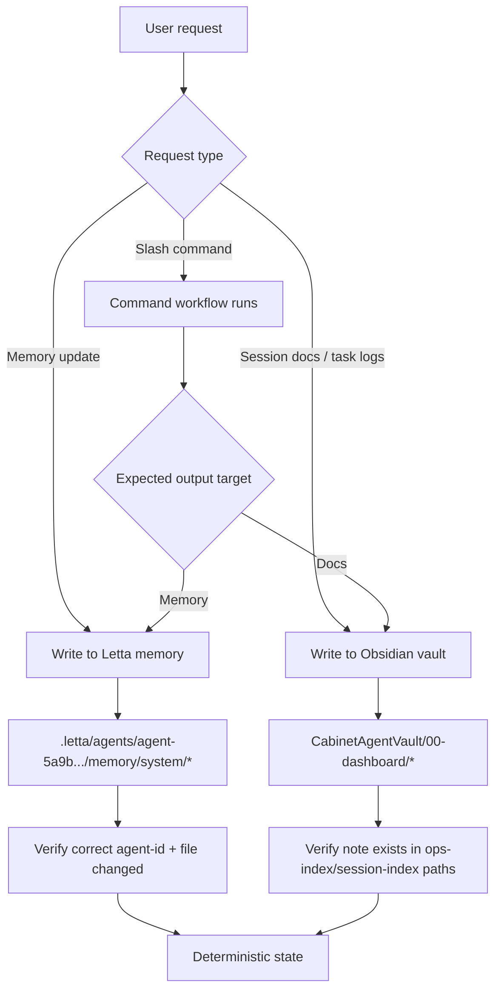
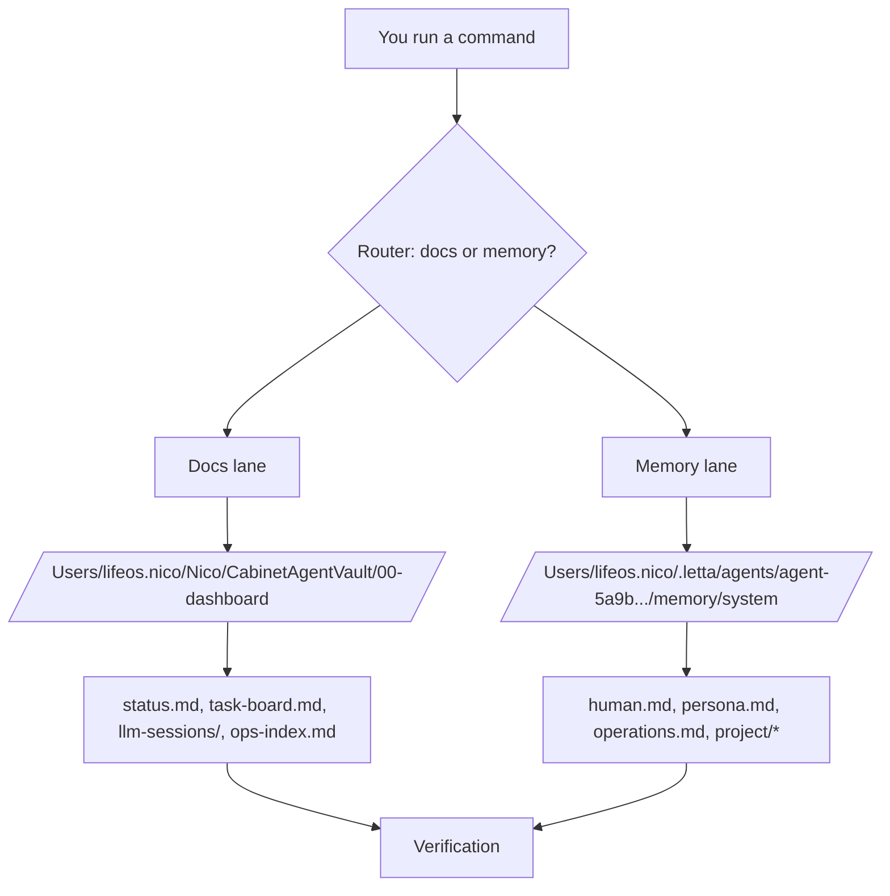

# Memory Layers Explainer

## Why this note exists
Use today’s findings to make memory behavior predictable and debuggable.

## What we confirmed today
- Memory writes happened on **other local Letta agent IDs**, not the main Nico agent (`agent-5a9b0e69-1f30-476d-a89a-30c8e21c9668`).
- The writes were identical across those 4 agents and contained generic bootstrap content (`human.md`, `persona.md`, small config).
- Main takeaway: this is a **target-routing issue**, not a data-loss issue.

## Folder hierarchy (the important parts)
```text
/Users/lifeos.nico/
├─ .letta/
│  └─ agents/
│     ├─ agent-5a9b0e69-1f30-476d-a89a-30c8e21c9668/   <-- MAIN NICO AGENT
│     │  └─ memory/
│     │     ├─ system/
│     │     │  ├─ human.md
│     │     │  ├─ persona.md
│     │     │  ├─ operations.md
│     │     │  ├─ ai-assistant/
│     │     │  └─ project/
│     │     └─ .git/
│     ├─ agent-<other-id-1>/
│     │  └─ memory/
│     │     └─ system/...
│     ├─ agent-<other-id-2>/
│     │  └─ memory/
│     │     └─ system/...
│     └─ ... (many other local agent memory folders)
│
└─ Nico/
   └─ CabinetAgentVault/
      └─ 00-dashboard/
         ├─ ops-index.md
         ├─ status.md
         ├─ task-board.md
         ├─ decisions.md
         └─ llm-sessions/
```

## Who uses what
- **Letta/Nico memory** uses: `~/.letta/agents/<agent-id>/memory/system/*.md`
- **Claude session docs / operational docs** use: `~/Nico/CabinetAgentVault/00-dashboard/...`
- These are related systems, but different storage layers.

## Where MemFS fits (important)
- MemFS is the git-backed memory filesystem for Letta agent memory.
- For main Nico, MemFS path is:
  - `/Users/lifeos.nico/.letta/agents/agent-5a9b0e69-1f30-476d-a89a-30c8e21c9668/memory`
- MemFS autosync on M1 (installed) handles periodic commit/push of memory changes:
  - Script: `~/Nico/Scripts/memfs-autosync.sh`
  - LaunchAgent: `~/Library/LaunchAgents/com.nico.memfs-autosync.plist`
  - Log: `~/Nico/Logs/memfs-autosync.log`

### MemFS quick checks
- Check job loaded:
  - `launchctl print gui/$(id -u)/com.nico.memfs-autosync | grep -E "state =|last exit code ="`
- Check recent autosync log lines:
  - `tail -n 40 ~/Nico/Logs/memfs-autosync.log`
- Check if main Nico memory repo is clean:
  - `git -C /Users/lifeos.nico/.letta/agents/agent-5a9b0e69-1f30-476d-a89a-30c8e21c9668/memory status`
- Check latest memory commits:
  - `git -C /Users/lifeos.nico/.letta/agents/agent-5a9b0e69-1f30-476d-a89a-30c8e21c9668/memory log --oneline -n 10`

## Slash commands and where they write
- `/handoff` (current workflow): writes session outputs into Obsidian vault docs (`00-dashboard/llm-sessions/`, `session-index`, etc.)
- Memory updates ("make it a memory"): should write to **main Nico agent memory** under `agent-5a9b.../memory/system/`
- Problem today: some writes targeted other local agent IDs instead.

## Deterministic write path (required rule)
1. Identify target first: `agent-5a9b0e69-1f30-476d-a89a-30c8e21c9668`
2. Write memory only under that agent path
3. Verify changed file + timestamp
4. Confirm content
5. Persist (commit/push) when needed

## Interaction flow (simple)


## Verification commands (copy/paste)
### 1) Confirm main Nico memory path
`ls -la /Users/lifeos.nico/.letta/agents/agent-5a9b0e69-1f30-476d-a89a-30c8e21c9668/memory/system`

### 2) See most recent writes in main Nico memory
`ls -ltR /Users/lifeos.nico/.letta/agents/agent-5a9b0e69-1f30-476d-a89a-30c8e21c9668/memory`

### 3) See all local agent folders
`ls -la /Users/lifeos.nico/.letta/agents`

### 4) Find today’s memory content writes across local agents (non-git files)
`python3 - <<'PY'
import os, datetime, pathlib
base=pathlib.Path('/Users/lifeos.nico/.letta/agents')
today=datetime.date.today()
for agent in base.iterdir():
    mem=agent/'memory'
    if not mem.exists():
        continue
    for root, dirs, files in os.walk(mem):
        dirs[:] = [d for d in dirs if d != '.git']
        for f in files:
            p=pathlib.Path(root)/f
            ts=p.stat().st_mtime
            dt=datetime.datetime.fromtimestamp(ts)
            if dt.date()==today:
                print(f"{dt.strftime('%Y-%m-%d %H:%M:%S')} | {agent.name} | {p}")
PY`

### 5) List Letta agents known by API (name + id)
`letta agents list --limit 200`

## Quick mental model
- Letta is multi-agent.
- Each agent is its own memory namespace.
- Obsidian session docs are not the same storage as Letta memory.
- “Synced” is only true for Nico when write target is `agent-5a9b...` and persistence is verified.

## Operational checkpoint
Before accepting any “memory synced” claim, verify:
1. Correct `agent-id`
2. File changed in that agent memory
3. Content is what was expected
4. Persisted state is clean
5. Main Nico can read/use it

## Simple 1-5 map (quick version)

### 1) Start with the command
- If you run a **slash command** like `/handoff`, first ask: "Is this supposed to create docs or memory?"

### 2) Route by output type
- **Docs output** → Obsidian vault (`CabinetAgentVault/00-dashboard/...`)
- **Memory output** → Letta main Nico memory (`agent-5a9b.../memory/system/...`)

### 3) Verify the write landed
- Docs: confirm file exists in `00-dashboard` / `llm-sessions`
- Memory: confirm file changed under `agent-5a9b...`

### 4) Verify content
- Open the file and check expected text actually exists

### 5) Mark as synced only after verification
- If write landed in another agent folder, treat as wrong target and re-route

## Diagram: 1-5 command routing
```mermaid
flowchart LR
    S1[1) Run command
Example: /handoff] --> S2{2) What output type?}
    S2 -->|Docs| S3A[3) Verify docs path
CabinetAgentVault/00-dashboard/*]
    S2 -->|Memory| S3B[3) Verify memory path
.letta/agents/agent-5a9b.../memory/system/*]
    S3A --> S4A[4) Open file and verify content]
    S3B --> S4B[4) Open file and verify content]
    S4A --> S5[5) Mark synced only if target+content are correct]
    S4B --> S5
```

## Diagram: folder interaction at a glance

